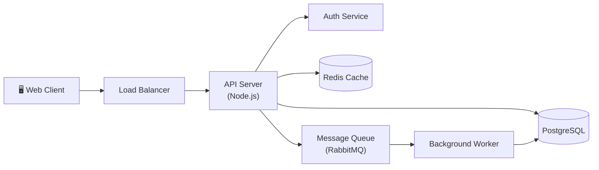
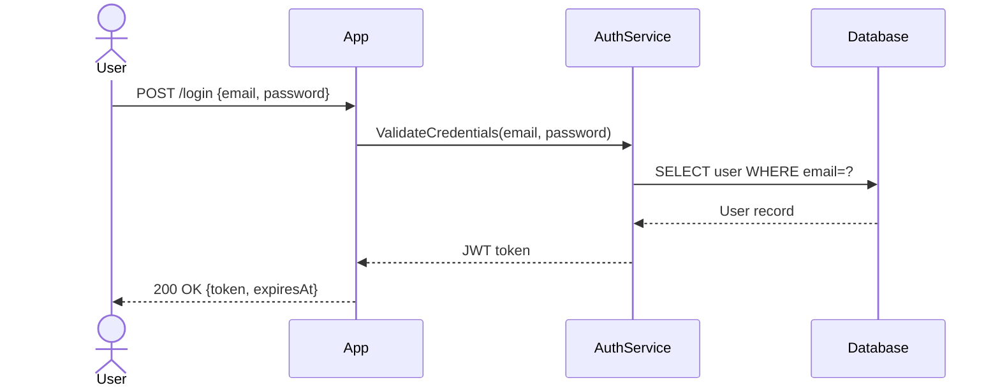
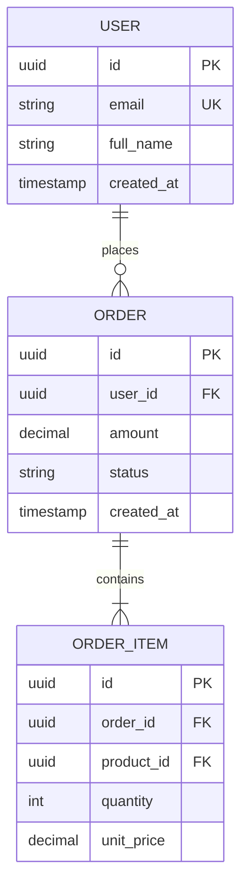
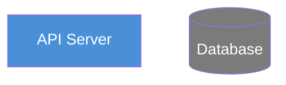

# Architecture Diagram Generator

Generate clear, readable Mermaid diagrams for system architectures, service
dependencies, API flows, and data models — ready to paste into Notion, GitHub,
or any Markdown renderer.

## When to Use

- Documenting how services connect in a system
- Visualizing API request/response flows
- Drawing ERDs for database schemas
- Creating C4 context diagrams for documentation
- Showing data pipelines or workflow sequences

## When NOT to Use

- Designing the architecture itself (this is a visualization skill)
- Generating image files (.png, .svg) — Mermaid renders in Markdown viewers
- UI wireframes or screen mockups

---

## Workflow

### Step 1 — Understand the Diagram Need

Ask the user:
1. **What to diagram:** System overview / API flow / Data model / Workflow / Service map
2. **Diagram type:** Flowchart / Sequence / ERD / C4 / Class / State machine / Gantt
3. **Level of detail:** High-level overview vs. detailed with all fields/methods
4. **Components involved:** List of services, tables, actors, or steps

### Step 2 — Select the Right Diagram Type

| Use case | Mermaid type |
|----------|-------------|
| Service topology / system overview | `flowchart LR` or `flowchart TD` |
| API or event sequence | `sequenceDiagram` |
| Database tables and relationships | `erDiagram` |
| System context / C4 | `C4Context` |
| Deployment / infrastructure | `flowchart` with styled nodes |
| State machine | `stateDiagram-v2` |
| Process / workflow steps | `flowchart TD` |
| Project timeline | `gantt` |

### Step 3 — Generate the Mermaid Code

#### System Architecture (Flowchart)

#### API Sequence Diagram

#### Entity-Relationship Diagram

### Step 4 — Apply Styling (Optional)

For flowcharts, add node styles for visual clarity:

### Step 5 — Present and Iterate

Show the diagram code and note:
- "This renders in GitHub Markdown, Notion, GitLab, and most Markdown editors."
- "Tip: Use [Mermaid Live Editor](https://mermaid.live) to preview."

Ask: "Should I add more detail, change the direction, or adjust any components?"

---

## Output Format

A Mermaid code block with:
1. The diagram type declaration on the first line
2. Clean, readable node IDs (not random letters)
3. Descriptive labels using quotes for multi-word/special character names
4. Grouping related nodes with `subgraph` where helpful

Include a brief explanation of what the diagram shows and any key relationships to note.

---

## Safety & Confirmation

- Don't include real hostnames, IP addresses, or internal service names unless the user explicitly provides them for documentation.
- For sequence diagrams showing auth flows, note any security concerns you observe (e.g., token passed in query string).
- Verify the diagram is syntactically valid Mermaid before presenting (review brackets, arrows, quoting).
